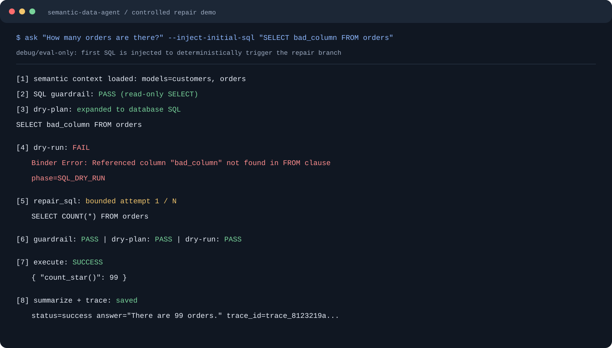
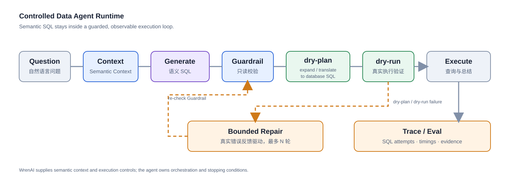

# Semantic Data Agent

> A controlled semantic data agent built with WrenAI, DeepSeek, guarded SQL execution, and evidence-driven improvement workflows.

面向企业自然语言问数场景的 Data Agent MVP：把用户问题转为经过语义上下文、只读 Guardrail、Wren `dry-plan`、真实 `dry-run` 和有界修复验证的可执行查询，并将完整过程写入 Trace。

## 先看结果

| 证据 | 结果 | 说明 |
| --- | ---: | --- |
| BIRD Mini-Dev Verified10 | **10/10** | 10 条经过筛选和复核的回归用例，不代表完整 BIRD benchmark 成绩 |
| TPC-H StarRocks Smoke | **5/5** | 真实 StarRocks + Wren + Data Agent 链路冒烟验证 |
| Unit tests | **175/175** | 使用项目 `.venv-wren` 环境完成的本次完整回归 |

**导航：** [30 秒理解](#30-秒理解) · [核心能力](#核心能力) · [系统架构](#系统架构) · [快速体验](#快速体验) · [评测结果](#评测结果) · [安全边界](#安全边界)



## 30 秒理解

传统 Text-to-SQL 只要“生成一条看起来像 SQL 的字符串”就可能继续执行；真实系统还必须处理语义错位、危险语句、底层方言转换、数据库真实错误和失败后的可追溯性。

```text
Semantic Context
-> LLM 生成面向 Wren 模型的语义 SQL
-> 只读 Guardrail
-> Wren dry-plan：展开并转译为底层数据库 SQL
-> Wren dry-run：在真实数据源上验证可执行性
-> 基于真实错误反馈的有界 Repair
-> 查询执行与结果总结
-> JSONL Trace / Eval
```

## 核心能力

### 1. 受控 Data Agent Runtime

- **语义上下文优先**：从 Wren semantic layer 获取模型、关系、规则和 NL-SQL examples，再交给 LLM 生成语义 SQL。
- **两阶段真实验证**：`dry-plan` 负责展开模型层 SQL 并转译为数据库方言；`dry-run` 负责在真实数据源上做可执行性验证，不返回最终 rows。
- **有界 Repair**：`dry-plan` 或 `dry-run` 失败时，把真实错误、上下文和上一版 SQL 回灌给 `repair_sql`；修复后重新通过 Guardrail，最多尝试有限轮次。
- **可追溯执行**：记录 SQL attempts、错误阶段、耗时、模型身份、最终 SQL、结果摘要和 Trace ID。

### 2. Context Onboarding

独立的 Context Builder 支持从 SQLite、DuckDB 和 StarRocks 生成 Wren MDL 候选，并由外层统一完成：

```text
数据源检查 -> 候选 Context / MDL -> validate / build / dry-run
-> artifact 校验 -> 人工审核 -> 发布或回滚
```

未经审核的 Context 候选不会直接进入在线问数路径。

### 3. Evidence-driven Improvement

开发期工作流将 Trace、Eval 和 Feedback 沉淀为 `FailureCase`、`Finding` 和冻结的 `EvalTarget`，再通过 Context 规则、生成 SQL、源码复现和 post-Context 失败四类确定性 Probe 做根因路由。它只生成可审核的 Context 或源码候选，不自动批准、合并或部署。

## 系统架构



完整职责分层图：


职责边界很明确：Data Agent 负责编排和停止条件；WrenAI 负责语义层、SQL 转译与执行控制；DeepSeek 负责 SQL 生成、修复和结果总结；Trace/Eval 负责观测和质量改进。

## 快速体验

当前公开入口是 Windows PowerShell 下的本地 CLI。项目依赖 Wren CLI、Python 环境和可用的 DeepSeek 兼容 API；仓库尚未提供从零创建 `.venv-wren` 的统一安装脚本。

```powershell
$env:PYTHONPATH='src'
python -m unittest discover -s tests
python -m data_subagent.cli doctor-wren
python -m data_subagent.cli ask "How many orders are there?"
python -m data_subagent.cli ask `
  "How many orders are there?" `
  --inject-initial-sql "SELECT bad_column FROM orders" `
  --limit 5
```

Repair 演示中的首轮坏 SQL 是通过 `--inject-initial-sql` 注入的；后续 Wren `dry-run` 错误、DeepSeek 修复、再次验证和执行均来自真实运行链路。

## 评测结果

### BIRD Mini-Dev Verified10

10 条经过筛选和复核的 `debit_card_specializing` 回归用例复跑为 `10/10`。其中 7 条自动通过，3 条进入人工 triage；这不是完整 BIRD benchmark 或排行榜结果。数据和过程见 [`docs/bird_starrocks_context_builder_test.md`](docs/bird_starrocks_context_builder_test.md)。

### TPC-H StarRocks Smoke

在本地 StarRocks SF 0.01 fixture 上完成 Wren Context Builder、`dry-plan`、`dry-run` 和 Data Agent smoke，复跑结果为 `5/5`。详情见 [`docs/starrocks_tpch_context_builder.md`](docs/starrocks_tpch_context_builder.md)。

### 测试回归

使用原项目 `.venv-wren` 环境对当前公开分支完整回归为 `175/175`。当前测试覆盖 Runtime loop、只读 SQL Guardrail、Wren CLI Adapter、Trace、评测和受控改进工作流；后续实现或环境变更后应重新运行测试并更新数字。

## 项目结构

```text
src/data_subagent/                    # 在线问数 Runtime
src/data_subagent_context_builder/   # 上游 Context / MDL onboarding
src/data_agent_improvement/          # Trace/Eval 驱动的受控改进
tests/                                # 单元与回归测试
docs/                                 # 架构、评测、复现与工程记录
```

深入入口：

- [`docs/data_subagent_mvp_plan.md`](docs/data_subagent_mvp_plan.md)：Runtime 边界、Adapter 和验收标准。
- [`docs/data_subagent_react_repair_demo.md`](docs/data_subagent_react_repair_demo.md)：正常路径与真实 Repair 路径。
- [`docs/data_agent_self_improvement_architecture_si0_contract.md`](docs/data_agent_self_improvement_architecture_si0_contract.md)：受控改进契约。
- [`docs/README.md`](docs/README.md)：完整文档索引。

## 安全边界

- 这是基于开源组件、公开数据和合成数据构建的独立工程，不代表任何公司或组织。
- 仓库不包含企业内部代码、内部数据、内部业务信息或凭据。
- 示例使用 TPC-H、BIRD Mini-Dev、jaffle_shop 或合成数据，并遵守 [`THIRD_PARTY_NOTICES.md`](THIRD_PARTY_NOTICES.md)。
- Runtime 默认只允许只读查询；接入真实数据源仍应使用最小权限账户、网络隔离和人工复核。
- 自改进流程只生成候选，不拥有业务真值确认、批准、Git 合并或部署权限。
- 本地密钥文件、`.env`、Trace 和本地 Wren 状态均不应提交。

## 当前限制

- 尚无从零创建 `.venv-wren` 的统一依赖安装脚本。
- 在线入口目前是 CLI，尚无 Web API 或生产部署配置。
- 真实数据源覆盖仍有限，外部评测结果需要人工复核。
- 评测数字绑定具体数据范围、运行条件和提交版本，不应脱离上下文解读。

## License

项目原创代码和文档采用 [MIT License](LICENSE)。BIRD Mini-Dev 衍生评测材料、jaffle_shop 演示来源和 TPC-H 名称等第三方内容不因本项目许可证而重新授权，详情见 [`THIRD_PARTY_NOTICES.md`](THIRD_PARTY_NOTICES.md)。
